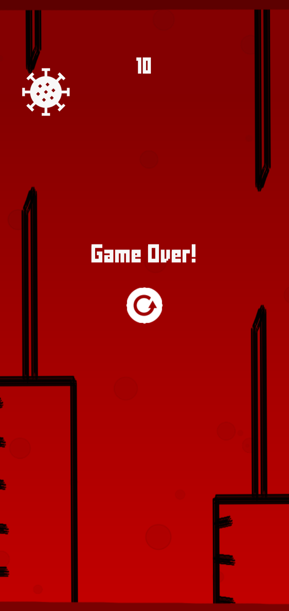
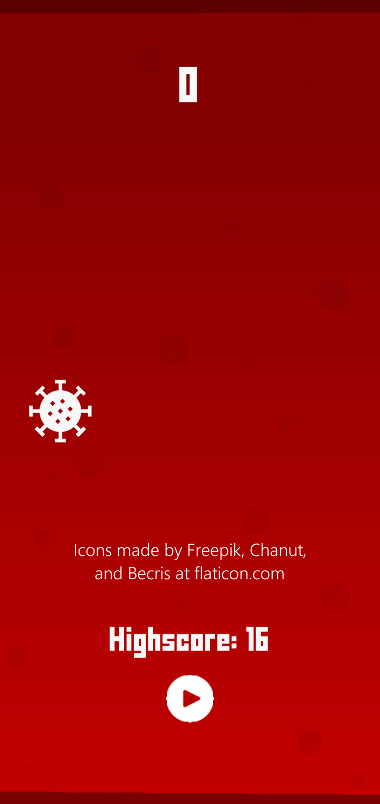

# Tappy Pathogen

This is a short project I did in Unity while following with [Renaissance Coders' YoutTube tutorial](https://www.youtube.com/watch?v=A-GkNM8M5p8&t=1120s)

Feel free to download the finished version [on Google Play](https://play.google.com/store/apps/details?id=com.zaelaapps.TappyPathogen)

## Attributions

The Pathogen icon was made by Freepik, the Play icon was made by Becris, and the Replay icon was made by Chanut, all at Flaticon.com

If you use their resources you **must** attribute them properly in your work.

All other artwork within the app is original and created by myself and licensed under [CC-BY](https://creativecommons.org/licenses/by/4.0/).
You are free to use, alter, or share the content however you'd like for commercial and non-commercial use so long as you properly attribute myself (Zaela) as the original creator.

## Licensing of non-artwork components

Although I did change some things, the code I wrote is very similar to the tutorial I linked above.
Due to the fact that the original creator of the tutorial never explicitly licensed his work, I do not feel comfortable explicitly licensing any of the work I've done here, aside from the artwork.
